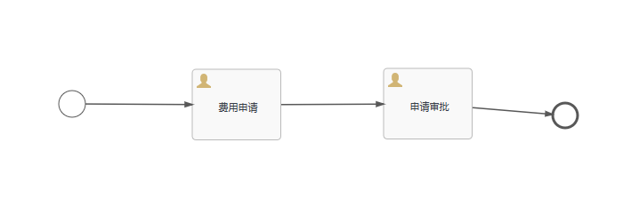

## activiti入门示例

### 1.activiti包引入

[pom.xml](./pom.xml)

```
<dependency>
  <groupId>org.activiti</groupId>
  <artifactId>activiti-engine</artifactId>
  <version>6.0.0</version>
</dependency>
```

### 2.新建activiti.cfg.xml配置文件

[官方配置文件](https://www.activiti.org/userguide/6.latest/#_configuration)

[/src/main/resources/activiti.cfg.xml](./src/main/resources/activiti.cfg.xml)

### 3.创建流程文件

[src/main/resources/first.bpmn20.xml](./src/main/resources/first.bpmn20.xml)



### 4.加载流程文件并启动流程


### 5.ORACLE排坑说明

在使用如下配置的时候,databaseSchemaUpdate为true,原本以为会创建数据库表

```
 <bean id="processEngineConfiguration" class="org.activiti.engine.impl.cfg.StandaloneProcessEngineConfiguration">
    <property name="jdbcUrl" value="jdbc:oracle:thin:@//192.168.17.135:1521/pdb1"/>
    <property name="jdbcDriver" value="oracle.jdbc.OracleDriver"/>
    <property name="jdbcUsername" value="act_01"/>
    <property name="jdbcPassword" value="act_01"/>
    <property name="databaseSchemaUpdate" value="true"/>
    <property name="asyncExecutorActivate" value="false" />
</bean>
```

运行me.chilam.FirstActiviti类发现报错,发现是schema没有设置，

```
### Error querying database.  Cause: java.sql.SQLSyntaxErrorException: ORA-00942: table or view does not exist

### The error may exist in org/activiti/db/mapping/entity/Property.xml
### The error may involve defaultParameterMap
### The error occurred while setting parameters
### SQL: select VALUE_ from ACT_GE_PROPERTY where NAME_ = 'schema.version'
### Cause: java.sql.SQLSyntaxErrorException: ORA-00942: table or view does not exist
```

修改配置文件为如下：增加<property name="databaseSchema" value="act_01"/>

```
<bean id="processEngineConfiguration" class="org.activiti.engine.impl.cfg.StandaloneProcessEngineConfiguration">
    <property name="jdbcUrl" value="jdbc:oracle:thin:@//192.168.17.135:1521/pdb1"/>
    <property name="jdbcDriver" value="oracle.jdbc.OracleDriver"/>
    <property name="jdbcUsername" value="act_01"/>
    <property name="jdbcPassword" value="act_01"/>
    <property name="databaseSchema" value="act_01"/>
    <property name="databaseSchemaUpdate" value="create-drop"/>
    <property name="asyncExecutorActivate" value="false" />
</bean>
```

再次运行me.chilam.FirstActiviti类发现报错

```
 20:33:10,069 ERROR CommandContext:122 - Error while closing command context
  java.lang.AbstractMethodError: oracle.jdbc.driver.T4CConnection.setSchema(Ljava/lang/String;)V
	at sun.reflect.NativeMethodAccessorImpl.invoke0(Native Method)
	at sun.reflect.NativeMethodAccessorImpl.invoke(NativeMethodAccessorImpl.java:62)
	at sun.reflect.DelegatingMethodAccessorImpl.invoke(DelegatingMethodAccessorImpl.java:43)
	at java.lang.reflect.Method.invoke(Method.java:498)
```

分析原因以为是oralce数据驱动原因，后来发现并不是,增加属性databaseTablePrefix，改动配置如下：

```
 <bean id="processEngineConfiguration" class="org.activiti.engine.impl.cfg.StandaloneProcessEngineConfiguration">
    <property name="jdbcUrl" value="jdbc:oracle:thin:@//192.168.17.135:1521/pdb1"/>
    <property name="jdbcDriver" value="oracle.jdbc.OracleDriver"/>
    <property name="jdbcUsername" value="act_01"/>
    <property name="jdbcPassword" value="act_01"/>
    <property name="databaseTablePrefix" value="ACT"/>
    <property name="databaseSchemaUpdate" value="true"/>
    <property name="asyncExecutorActivate" value="false" />
</bean>

```

但是还是发现报错,发现多拼接一个前缀ACT

```
### The error may exist in org/activiti/db/mapping/entity/Property.xml
### The error may involve org.activiti.engine.impl.persistence.entity.PropertyEntityImpl.selectProperty-Inline
### The error occurred while setting parameters
### SQL: select * from ACTACT_GE_PROPERTY where NAME_ = ?
### Cause: java.sql.SQLSyntaxErrorException: ORA-00942: table or view does not exist

```

但是此时将配置修改如下：

```
 <bean id="processEngineConfiguration" class="org.activiti.engine.impl.cfg.StandaloneProcessEngineConfiguration">
        <property name="jdbcUrl" value="jdbc:oracle:thin:@//192.168.17.135:1521/pdb1"/>
        <property name="jdbcDriver" value="oracle.jdbc.OracleDriver"/>
        <property name="jdbcUsername" value="act_01"/>
        <property name="jdbcPassword" value="act_01"/>
        <property name="databaseSchemaUpdate" value="false"/>
        <property name="asyncExecutorActivate" value="false" />
    </bean>
```

在运行me.chilam.FirstActiviti这个类，就正常了

```
 第一个任务，当前任务名称: 费用申请
第二个任务，当前任务名称：申请审批
流程结束后，查找任务: null
```


    


    