## 2.安装与运行Activiti

#### 2.1下载与安装

-  [activiti6.0下载](https://github.com/CasperMXP/Activiti/releases/tag/activiti-6.0.0)

- 下载解压后得到activiti-6.0.0目录，该目录下有3个子目录：database,libs,wars.

    - database，用于存放Activiti数据库建模初始化脚本，create,drop,upgrade
    - libs,存放本版本activiti所发布的jar包，也包含相应的源码
    - wars,activiti-app.war,activiti-admin.war,activiti-rest.war
 
#### 2.2关于activiti-app.war和activiti-admin.war使用

##### 2.2.1部署activiti-app.war和activiti-admin.war

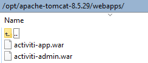   

##### 2.2.2访问activiti-app路径(http://192.168.17.18:8080/activiti-app/#/login), 用户名/密码(admin/test)
 
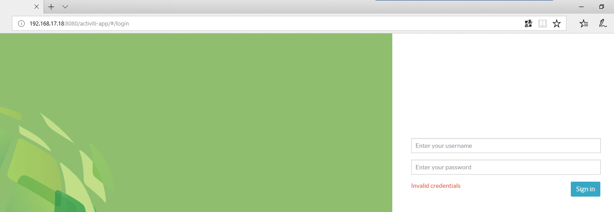

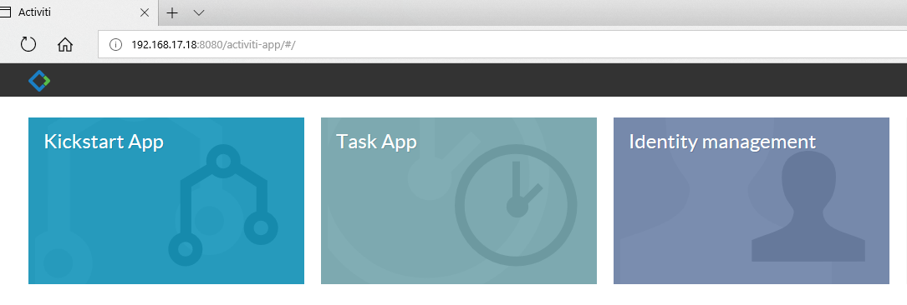

- Kickstart App,主要用于流程模型管理，表单管理以及应用管理，一个应用可以包含多个流程模型，应用可发布给其他用户使用。

- Task App，用于管理整个activiti-app的任务，该功能里面也可以启动流程

- Identity management，身份信息管理，可管理用户，用户组等数组

##### 2.2.3创建用户，用户(创建chilam，casper用户)

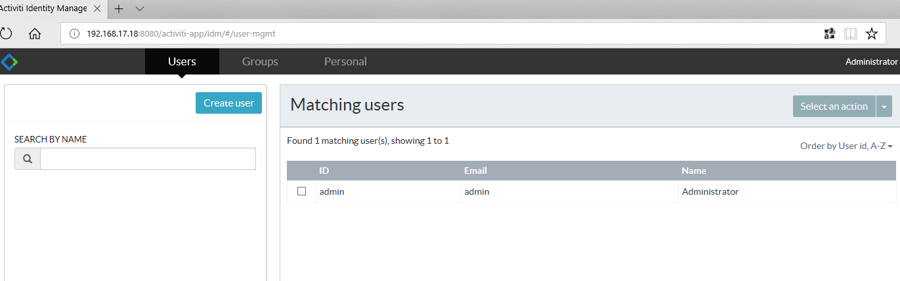

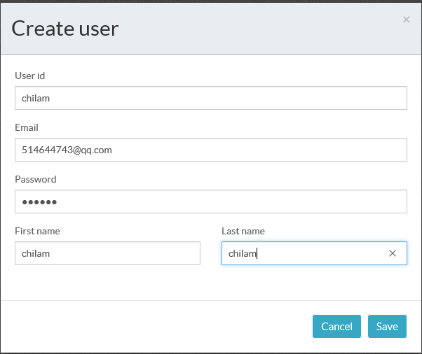

##### 2.2.4定义流程

点击Kickstart菜单，进入流程模型管理界面，点击“Create Process”按钮，弹出新建流程模型界面

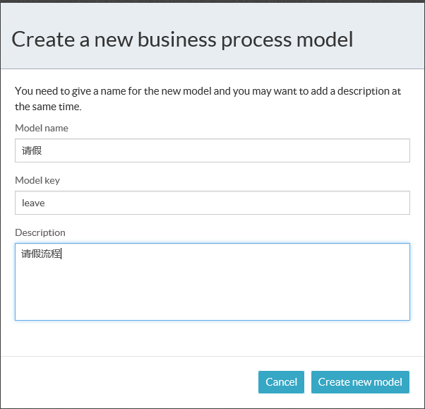

设置开始节点“Initiator”为“casper”

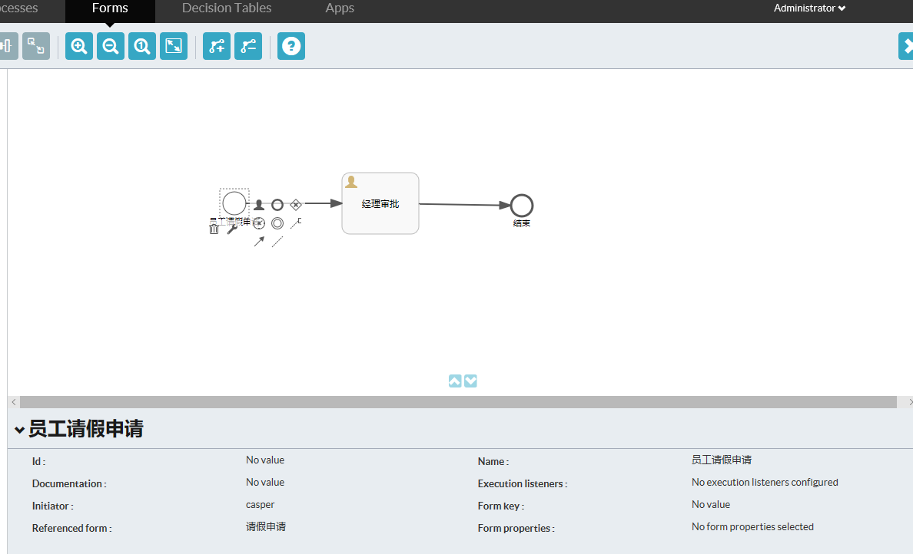

点击“Reference form”弹出“Create a new form”

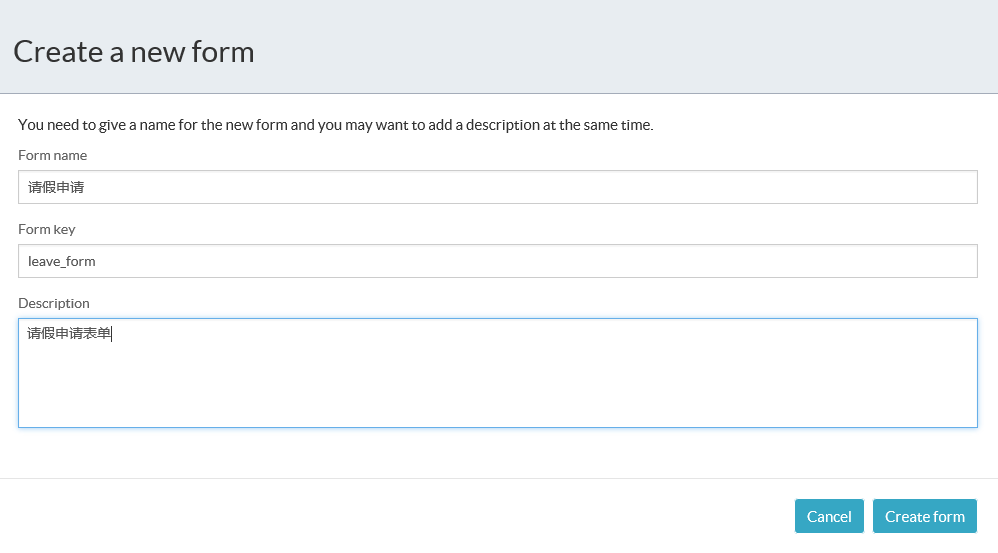

设计的请假表单如下

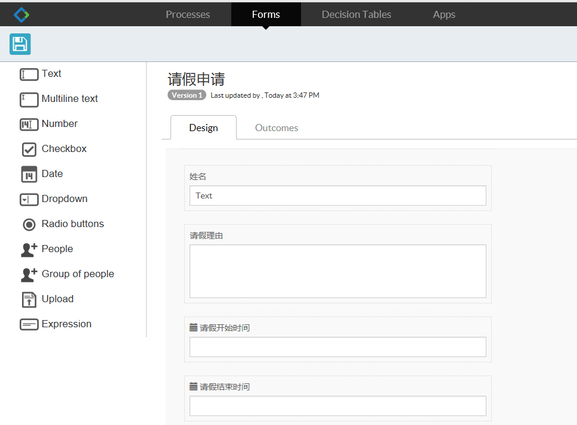

点击设置“经理审批”节点“Assignment”属性->审批人

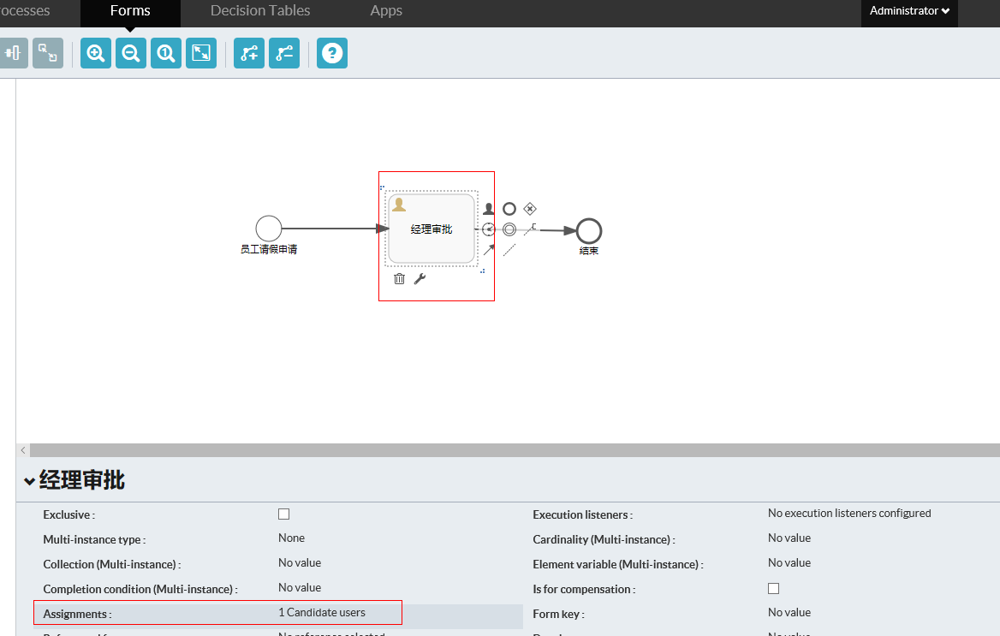

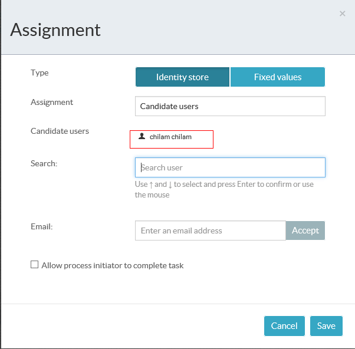

##### 2.2.4发布流程

点击“Create App”按钮，弹出如下显示界面

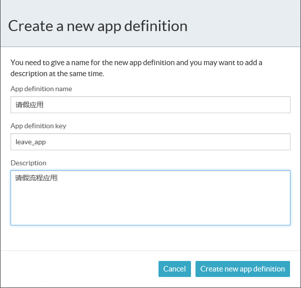

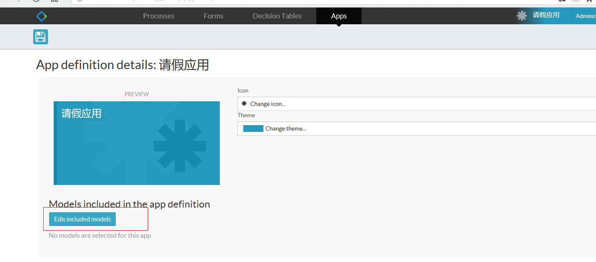

点击“Edit included model”选择刚刚创建好的流程

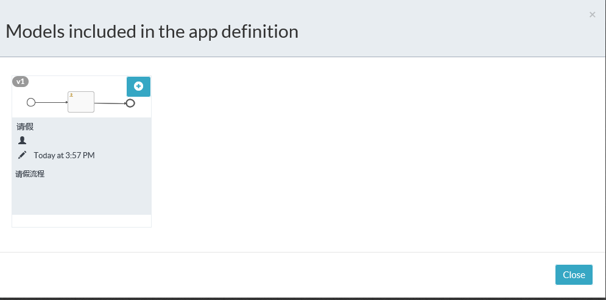

点击“publish”发布应用

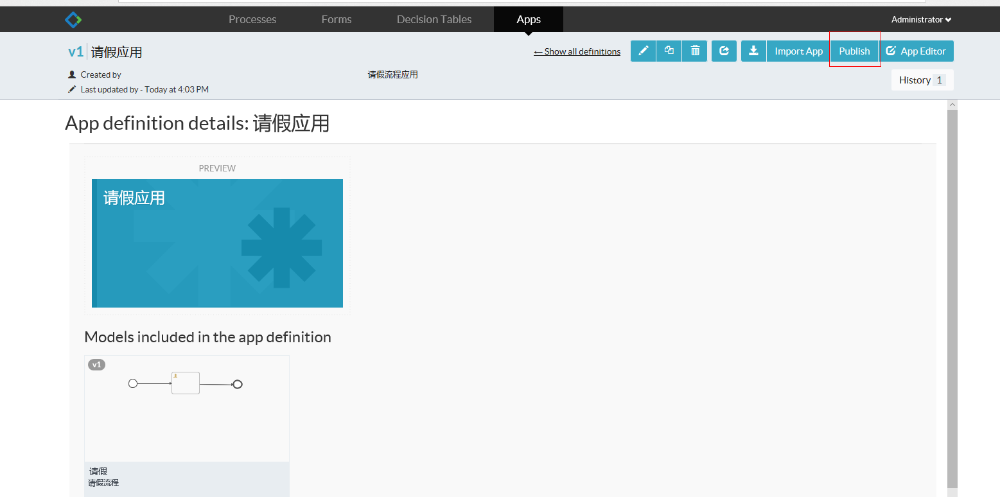

##### 2.2.5启动与完成流程

登录casper账户，发起流程

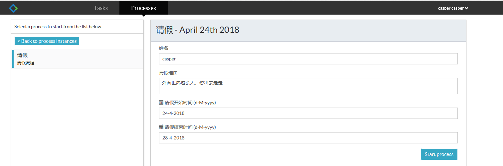

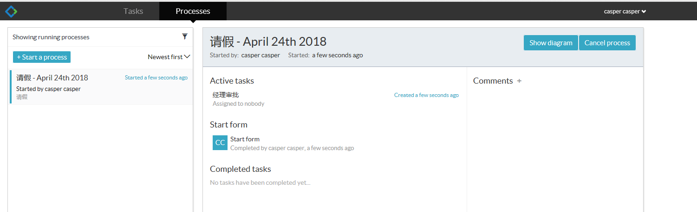

登录chilam账户，审批流程

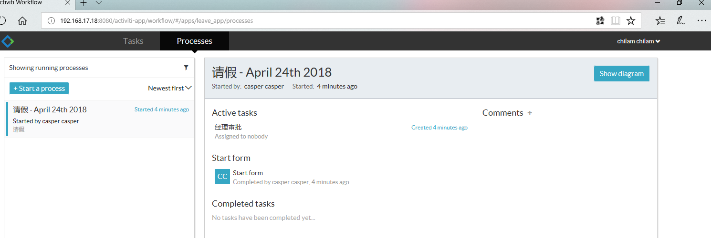

##### 2.2.6流程引擎的管理

访问(http://192.168.17.18:8080/activiti-admin/#/login)，用户名/密码（admin/admin）

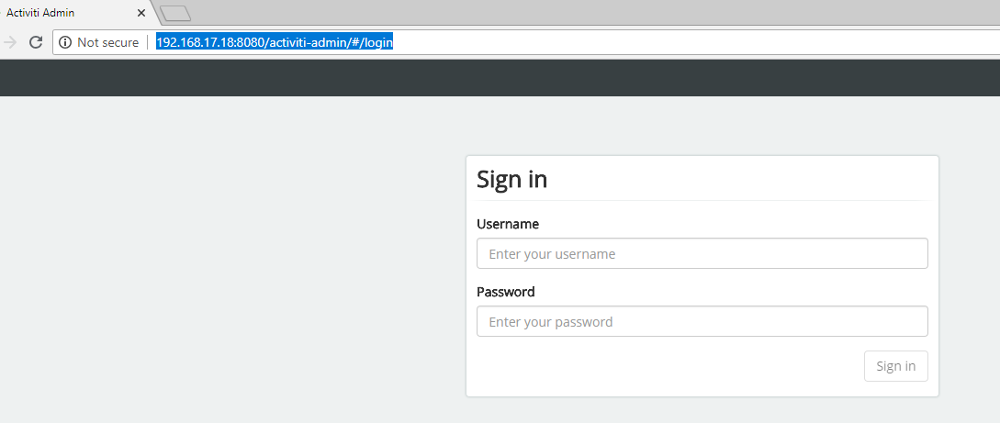

点击“Edit Activiti REST endpoint”,修改“Server Port”和“password”

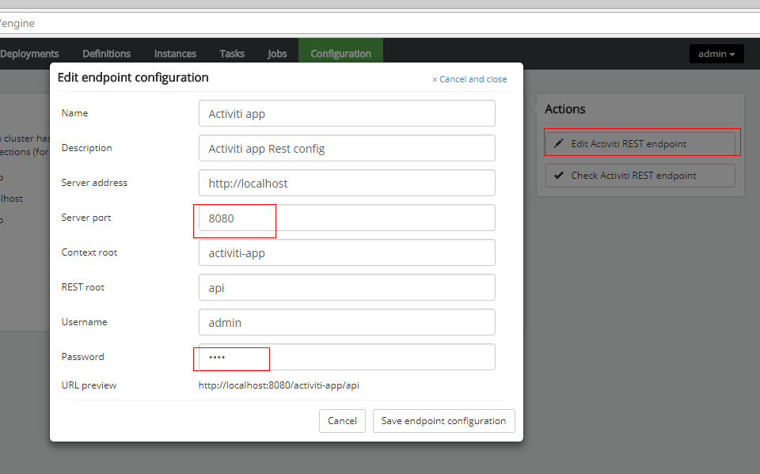

此时可以查看activiti-app的发起的流程

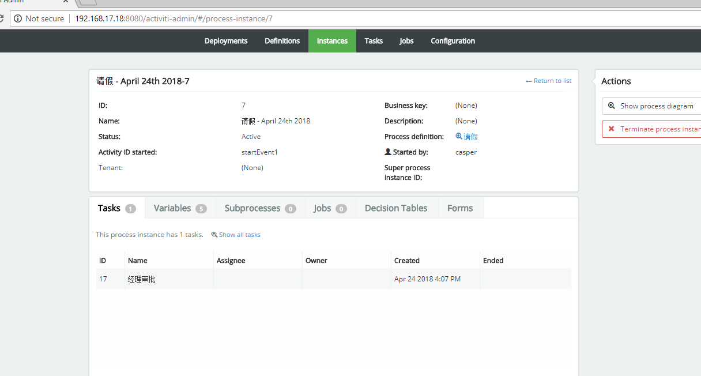
